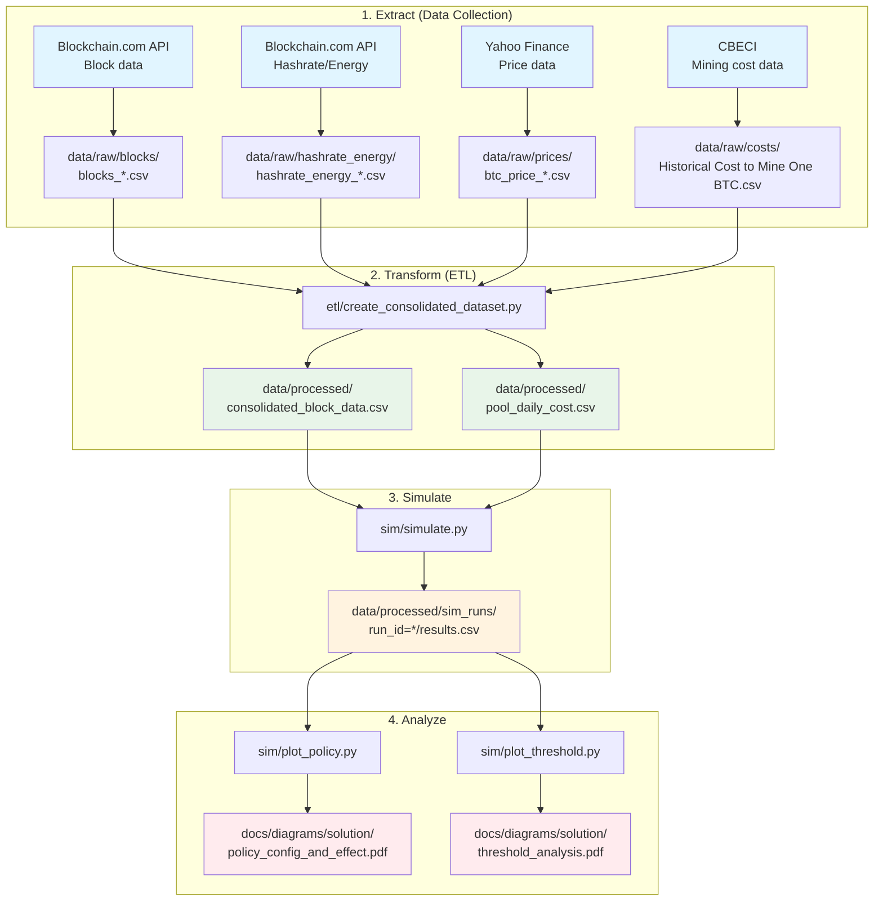

# Bitcoin Simulation Data Pipeline

## Pipeline Overview

```
[1. Extract] → [2. Transform] → [3. Simulate] → [4. Analyze]
```

## Pipeline Diagram



## Step 1: Extract (Data Collection)

### 1.1 Block Data
- **Source**: Blockchain.com API
- **Script**: `python etl/fetch_blocks.py`
- **Output**: `data/raw/blocks/blocks_blockchain_com_*.csv`
- **Columns**: `height`, `block_timestamp`, `total_fees_sat`, `total_vbytes`, `avg_sat_per_vb`, `tx_count`, `weight`, `size_bytes`, `pool_name`

### 1.2 Hashrate/Energy Data
- **Source**: Blockchain.com API
- **Script**: `python etl/fetch_hashrate_energy.py`
- **Output**: `data/raw/hashrate_energy/hashrate_energy_*.csv`
- **Columns**: `date`, `hashrate_eh`, `power GUESS, GW`, `annualised consumption GUESS, TWh`

### 1.3 Price Data
- **Source**: Yahoo Finance
- **Script**: `python etl/fetch_price.py`
- **Output**: `data/raw/prices/btc_price_*.csv`
- **Columns**: `date`, `btc_usd`

### 1.4 Mining Cost Data (CBECI)
- **Source**: CBECI (Cambridge Bitcoin Electricity Consumption Index)
- **File**: `data/raw/costs/Historical Cost to Mine One BTC (daily).csv`
- **Columns**: `Date`, `Estimated cost of minting USD`

### 1.5 MEV Data
- **Source**: Parameter-based estimation
- **File**: `mev/mev_samples_parameter_based.csv`
- **Columns**: `height`, `mev_sat`, `mev_usd`

---

## Step 2: Transform (ETL)

### 2.1 Create Consolidated Dataset
```bash
python etl/create_consolidated_dataset.py
```

**Inputs**:
- `data/raw/blocks/blocks_*.csv`
- `data/raw/prices/btc_price_*.csv`
- `data/raw/costs/Historical Cost to Mine One BTC (daily).csv`
- `data/raw/pools/pools_timeseries_daily_*.csv`
- `mev/mev_samples_parameter_based.csv`

**Outputs**:
- `data/processed/consolidated_block_data.csv`
  - Columns: `height`, `date`, `block_timestamp`, `total_vbytes`, `avg_sat_per_vb`, `mev_sat`, `block_subsidy_sat`, `btc_usd`, `miner_id`, `pool_name`
- `data/processed/pool_daily_cost.csv`
  - Columns: `date`, `miner_id`, `pool_name`, `daily_share`, `cost_usd_per_day`

---

## Step 3: Simulate

### 3.1 Run Simulation
```bash
python sim/simulate.py --config sim/config_default.yaml
```

**Inputs**:
- `data/processed/consolidated_block_data.csv`
- `data/processed/pool_daily_cost.csv`
- `sim/config_default.yaml`

**Outputs**:
- `data/processed/sim_runs/run_id=YYYYMMDD_HHMMSS/results.csv`
- `data/processed/sim_runs/run_id=YYYYMMDD_HHMMSS/config.yaml`

**Evaluation Metrics**:
- `beta_bar` - Deviation ratio (BFT stability: β < 1/3)
- `ROI_mean` - Average return on investment
- `stable_bft` - BFT stability flag
- `rho_honest`, `rho_dev` - Orphan rates

---

## Step 4: Analyze

### 4.1 Policy Effect Visualization
```bash
python sim/plot_policy.py
```

**Output**: `docs/diagrams/monthly_analysis/solution/policy_config_and_effect.pdf`

### 4.2 Threshold Analysis
```bash
python sim/plot_threshold.py
```

**Output**: `docs/diagrams/monthly_analysis/solution/threshold_analysis.pdf`

---

## Quick Commands

### Full Pipeline (from scratch)
```bash
# 0. Activate environment
source source/bin/activate

# 1. Data collection (if raw data needs refresh)
python etl/fetch_blocks.py
python etl/fetch_price.py
python etl/fetch_hashrate_energy.py

# 2. ETL (if raw data changed)
python etl/create_consolidated_dataset.py

# 3. Simulation
python sim/simulate.py --config sim/config_default.yaml

# 4. Visualization
python sim/plot_policy.py
python sim/plot_threshold.py
```

### Quick Run (data already exists)
```bash
source source/bin/activate
python sim/simulate.py --config sim/config_default.yaml
python sim/plot_policy.py
```

---

## Data Transformation Mapping

| Raw File | Processed File | Script |
|----------|----------------|--------|
| `blocks_*.csv` | `consolidated_block_data.csv` | `create_consolidated_dataset.py` |
| `btc_price_*.csv` | `consolidated_block_data.csv` | `create_consolidated_dataset.py` |
| `Historical Cost to Mine One BTC.csv` | `pool_daily_cost.csv` | `create_consolidated_dataset.py` |
| `pools_timeseries_*.csv` | `pool_daily_cost.csv` | `create_consolidated_dataset.py` |
| `mev_samples_parameter_based.csv` | `consolidated_block_data.csv` | `create_consolidated_dataset.py` |

---

## Current Status

### ✅ Completed
1. Data collection (blocks 790,000-890,000)
2. ETL processing
3. Simulation implementation
4. Policy analysis visualization

### File Structure
```
btc_exp/
├── etl/
│   ├── create_consolidated_dataset.py  # Main ETL script
│   ├── fetch_blocks.py                 # Block data collection
│   ├── fetch_blocks_auto_resume.py     # Auto-resume block fetching
│   ├── fetch_costs.py                  # Cost data collection
│   ├── fetch_hashrate_energy.py        # Hashrate/energy collection
│   ├── fetch_price.py                  # Price data collection
│   ├── fetch_mempool.py                # Mempool data
│   ├── fetch_mempool_audit.py          # Audit data
│   └── fetch_mev_from_blocks.py        # MEV extraction
├── sim/
│   ├── simulate.py                     # Main simulation
│   ├── config_default.yaml             # Configuration
│   ├── plot_policy.py                  # Policy visualization
│   ├── plot_threshold.py               # Threshold visualization
│   └── run_and_summarize.py            # Summary generation
├── analysis/
│   ├── 01_calc_pool_cost.py            # Pool cost calculation
│   ├── 02_calc_pool_profit.py          # Pool profit calculation
│   ├── 03_plot_pool_profit.py          # Profit visualization
│   ├── 04_analyze_blocks.py            # Block analysis
│   ├── 05_check_data_integrity.py      # Data integrity check
│   └── 06_pool_audit_analysis.py       # Audit analysis
├── data/
│   ├── raw/                            # Raw data
│   └── processed/                      # Processed data
│       ├── consolidated_block_data.csv
│       ├── pool_daily_cost.csv
│       └── sim_runs/                   # Simulation results
└── mev/
    └── mev_samples_parameter_based.csv # MEV estimates
```

---

## Troubleshooting

### Common Issues

1. **Missing data files**
   - Run ETL scripts in order
   - Check `data/raw/` for source files

2. **Simulation errors**
   - Verify `consolidated_block_data.csv` has required columns
   - Check `pool_daily_cost.csv` exists

3. **Visualization errors**
   - Ensure simulation results exist in `data/processed/sim_runs/`
   - Update `RESULTS_PATH` in plot scripts if needed
